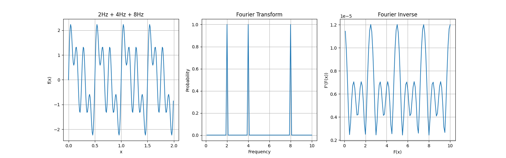

# Fourier Transform

This is a demonstration of fourier transform and fourier inverse made in
python using the `scipy.fft` module (for educational purpose)



This demonstraion uses combination of sine waves of 2Hz, 4Hz and 8Hz.
You may play with the `driver.py` file to try this with other frequencies

```py
def f(x):
    x = 2*np.pi*x
    return (np.sin(2*x)+np.sin(4*x)+np.sin(8*x))+2.5
```
Just change the coefficient of x inside the sin functions to change the frequency.
You may also add more number of sin function by just adding more `np.sin` functions
